# PopVote 4.0 Cryptography Specification

## Introduction

This document provides the technical specification for the cryptographic system of the PopVote 4.0
project. It is a simple, pragmatic, and secure system for polling in physical voting stations or
over the internet created by The Hong Kong Public Opinion Research Institute (HKPORI) for
large-scale electronic polling. It is designed for non-government and unofficial polling as a mean
to measure and express public opinions in authoritarian regimes. In consideration of the
politically-sensitive nature, the system must guarantee strong privacy to the voters.

## Overview

PopVote 4.0 is designed for non-government and unofficial opinion polling in authoritarian regimes.
From the experience of the 2014 Civil Referendum project in Hong Kong, we have learned that such
unofficial polling, despite lack of a binding effect, is a valuable tool for people to express their
views. Consequently, organizers of these unofficial polling in authoritarian regimes were often
under considerable threat.

PopVote 4.0 design goals are based on the particular situation in Hong Kong and the PopVote project;
it does not intend to be a polling system for elections in democratic states. These are the
properties that we want to achieve in PopVote 4.0:

* **Voter privacy.** Voters' identity information is not disclosed even if online servers of the
  system were compromised.
* **Invulnerability** A system is invulnerable if (1) it permits only eligible voters to vote, and
  (2) it ensures that each eligible voter can vote only once.
* **Fairness.** No participant can gain any knowledge, except his or her vote, about the (partial) tally
  before the counting phase.
* **Availability.** The system remains functional even if some of the servers are forced offline.
* **Convenience.** The system allows voters to cast their votes quickly, in one session, and with
  minimal equipment or special skills.
* **Simplicity.** The system can be implemented using commonly available libraries and tools.

Several other properties are desirable for electronic polling systems. However, they are not fully
achieved in PopVote 4.0:

* **Strong anonymity.** A system is anonymous if neither polling authorities nor anyone else can (1)
  link any ballot to the voter who cast it, and (2) link two ballots in two polling sessions to the
  same voter. PopVote 4.0 addressed the first part of anonymity property by separating voter
  validation and tallier roles. It also uses one-way hashing and procedural controls to prevent the
  disclosure of voter information. However, we do not address the second part of the anonymity
  property.
* **Verifiability.** A system is verifiable if anyone can independently verify that all votes have
  been counted correctly. PopVote 4.0 satisfies a weaker form of verifiability. It allows external
  observers to verify the correctness of the tallying process by sharing pseudonymous voter
  identities.
* **Coercion-resistance.** A system is said to be coercion resistant if the voter cannot cooperate
  with a coercer to prove to him that she voted in a certain way. PopVote 4.0 does not address
  coercion resistance.

### Usage Scenario

PopVote 4.0 is designed for an in-person voting scenario where voters visit physical voting stations
to verify their identities and submit ballots. In this scenario, voters fill in the ballot on their
own mobile device with an app. The app then generates a QR code. Voters show the QR code to a voting
station device. An officer in the voting station verifies voter's ID documents and then submits the
ballot to a central server.

PopVote 4.0 does not support online voting. However, the cryptographic system design described in
this document provides the capability for voters in the current version to vote over the internet in
a future software upgrade.

## External Functions

The main building block of the PopVote 4.0 cryptographic system is NaCl's
[box](http://nacl.cr.yp.to/box.html), [secretbox](http://nacl.cr.yp.to/secretbox.html), and
[signatures](http://nacl.cr.yp.to/sign.html) constructions. It is recommended to use high-level
cryptography libraries such as [libsodium](https://github.com/jedisct1/libsodium) and
[tweetnacl-js](https://tweetnacl.js.org/) to implement this system to avoid common security
pitfalls.

### Concatenation

The concatenation of byte sequences `X` and `Y` is `X || Y`.

### Public-key Authenticated Encryption

The `crypto_box_keypair` function randomly generates a secret key and a corresponding public key.

The `crypto_box` function encrypts and authenticates a message `m` using the sender's secret key
`sk`, the receiver's public key `pk`, and a nonce `n`, and returns ciphertext `c`. `n` should be
`crypto_box_NONCEBYTES` bytes. `c` should be at least `crypto_box_MACBYTES` bytes longer than the
plaintext `m`. This function writes the authentication tag, whose length is `crypto_box_MACBYTES`
bytes, immediately followed by the encrypted message, whose length is the same as the plaintext `m`.

The `crypto_box_open` function verifies and decrypts a ciphertext produced by `crypto_box`.

The nonce doesn't have to be random nor confidential, but it should be used with just one invocation
of `crypto_box` for a particular pair of public and secret keys.

#### Algorithm Details

* Key exchange: X25519
* Encryption: XSalsa20 stream cipher
* Authentication: Poly1305 MAC
* `crypto_box_PUBLICKEYBYTES = 32`
* `crypto_box_SECRETKEYBYTES = 32`
* `crypto_box_MACBYTES = 16`
* `crypto_box_NONCEBYTES = 24`

### Public-key Signatures

The `crypto_sign_keypair` function randomly generates a secret key and a corresponding public key.

The `crypto_sign` function signs the message `m`, using the secret key `sk`, and returns the
signature, which can be up to `crypto_sign_BYTES` bytes long.

The `crypto_sign_open` function checks that the signed message `sm` has a valid signature for the
public key `pk`.

#### Algorithm Details

* Signature: Ed25519
* `crypto_sign_PUBLICKEYBYTES = 32`
* `crypto_sign_SECRETKEYBYTES = 64`
* `crypto_sign_BYTES = 64`

### Secret-key Authenticated Encryption

The `crypto_secretbox` function encrypts a message `m`, with a key `k` and a nonce `n`. `k` should
be `crypto_secretbox_KEYBYTES` bytes and `n` should be `crypto_secretbox_NONCEBYTES` bytes. `c`
should be at least `crypto_secretbox_MACBYTES` longer than the plaintext `m`. This function writes
the authentication tag, whose length is `crypto_secretbox_MACBYTES` bytes, immediately followed by
the encrypted message, whose length is the same as the plaintext `m`.

The nonce doesn't have to be random nor confidential, but it should never be reused with the same
key.

#### Algorithm Details

* Encryption: XSalsa20 stream cipher
* Authentication: Poly1305 MAC
* `crypto_secretbox_KEYBYTES = 32`
* `crypto_secretbox_MACBYTES = 16`
* `crypto_secretbox_NONCEBYTES = 24`

### Hashing

The `crypto_hash` function returns SHA-512 hash of the message.

#### Algorithm Details

* Algorithm: SHA-512
* `crypto_hash_sha512_BYTES = 64`

### Key Stretching

The `scrypt` function derives a `OUTPUTBYTES` bytes long key from a password `passwd` and a
salt whose fixed length is `SALTBYTES` bytes.

#### Algorithm Details

* Algorithm: scrypt
* `N = 1<<15`
* `r = 8`
* `p = 1`
* `OUTPUTBYTES = 32`
* `SALTBYTES = 32`

## Roles

### Actors

* **Polling Authority** is a group of individuals who hold a share to the keys to sign manifest
  files. They are responsible for maintaining the system's integrity, such as authorizing Tallying
  Authority and Voting Station Devices.
* **Tallying Authority** is a group of individuals who hold a share to the keys to decrypt ballots.
  They are responsible for the tallying process. There can be multiple Tallying Authority for
  individual polling sessions.
* **Voting Station Supervisors** are trusted personnel who are responsible for the operation in a
  voting station. Each Voting Station has one supervisor.
* **Voting Station Officers** are trusted personel who are responsible for verifying voters' ID
  documents and submitting ballots through Voting Station Devices.
* **Voters** are persons who vote using their own mobile devices.

### System Modules

* **Operation Center** is an isolated (air-gapped) computer for processing sensitive tasks such as
  tallying.
* **Application Server** is used to store encrypted ballot data. The addresses of the servers are
  hidden from the public to minimize the risks of DDoS and other attacks.
* **CDN** is a service for distributing the static Manifest File. It must be resilient to
  large-scale DDoS attacks.
* **Voting Station Devices** are trusted mobile devices for registering voters and submitting
  ballots. Each voting station has one or more Voting Station Devices.
* **Voter Client** is a mobile app used by Voters to vote.

## Cryptographic System

The following diagram describes the high-level transactions between the system modules:

### Set-up Phase

#### Polling Authority Signing Key

The **Polling Authority Signing Key** is a NaCl Ed25519 signing key that is used to sign manifest
files. The Polling Authority public signing key is bundled with the Voting Station and Voter mobile
apps. The key is the trust anchor of the cryptographic system of PopVote 4.0.

The **Operation Center** generates the **Polling Authority Signing Key** with these steps:

1. Generate a NaCl Ed25519 signing key using `crypto_sign_keypair`.
2. Split the key using Shamir's Secret Sharing Scheme.
3. Distribute the key share to each **Polling Authority** key holder.

The key splitting and distribution procedure is described in the Procedure Specification document.

#### Tallying Authority Encryption Key

The **Tallying Authority Encryption Key** is a NaCl Curve25519 encryption key that is used to
encrypt and decrypt ballots. New Tallying Authority Encryption Keys may be used for different voting
sessions to limit the scope of each key.

The **Operation Center** generates the **Tallying Authority Encryption Key** with these steps:

1. Generate a NaCl Curve25519 **Tallying Authority Encryption Key** keypair using
   `crypto_box_keypair`.
2. Split the key using Shamir's Secret Sharing Scheme.
3. Distribute the key share to each **Tallying Authority** key holder.

The key splitting and distribution procedure is described in the Procedure Specification section.

#### Voting Station Device

Each **Voting Station Device** has a **Voting Station Signing Key** and **Voting Station Encryption
Key**. The Voting Station Device keys are generated by batch by the Operation Center. The keys are
generated and distributed to stations with these steps.

1. Generate a NaCl Ed25519 **Voting Station Signing Key** keypair using `crypto_sign_keypair`.
2. Generate a NaCl Curve25519 **Voting Station Encryption Key** keypair using `crypto_box_keypair`.
3. Obtain a **Voting Station Password**. Multiple **Voting Station Devices** in the same station
   share the same **Voting Station Password**.
4. Take `scrypt` of the **Voting Station Password** with the salt `popvote_2020_station_pwd` to give
   the **Key Wrapping Key**.
5. Generate a random 24-byte **Nonce**.
6. Concatenate the Voting Station private signing key and private encryption key to form the
   encryption input.
7. Encrypt the bytes from #6 key using `crypto_secretbox` with the **Key Wrapping Key** from #4 and
   the random nonce from #5.
8. Prepend the **Nonce** on the encrypted bytes from #7 to give the **Encrypted Voting Station
   Key**.
6. Register the station public keys as an authorized station device and erase the private keys.
7. Generate a QR code from **Encrypted Voting Station Key** for later distribution.

The **Polling Authority** then distributes the **Encrypted Voting Station Key** QR code and the
**Voting Station Password** to **Voting Station Supervisors**. For security reasons, they must be
distributed with different communication channels.

A Voting Station Device is initialized with these steps:

1. Scan the **Encrypted Voting Station Key** QR code.
2. Voting Station Supervisor enters the **Voting Station Password**.
3. Compute **Key Wrapping Key** from the **Voting Station Password**.
3. Open the **Encrypted Voting Station Key**.
4. Derive the **Voting Station Public Signing Key** from the private key.
5. Fetch signed Manifest File from the CDN server.
6. Verify the signature in Manifest File against a static public key predefined in the Voting
   Station mobile app.
7. Obtain the voting station data from the Manifest File by the voting station public signing key.
8. Store the **Encrypted Voting Station Key** in the voting station device's storage.

The Voting Station Device should not store the **Voting Station Password** and the decrypted private
keys in its storage. The device should decrypt and store the **Voting Station Signing Key** and
**Voting Station Encryption Key** in memory for a limited period of time. The supervisors must
re-enter the **Voting Station Password** to the app to decrypt the keys when they expire.

#### Signed Manifest File

The **Manifest File** contains these contents:

* **Sequence** is a sequence number increased for each revision of the Manifest File. Clients should
  reject a Manifest File if the sequence is smaller than the last seen sequence number.
* **Tallying Authority Public Encryption Key** is a NaCl public encryption key.
* **Ephemeral Public Key** is a NaCl public encryption key. The ephemeral keypair is generated at
  random and only used for one version of **Manifest File**.
* **Station Secretbox** is a `crypto_secretbox` containing private data for Station Devices, such as
  Application Server URL, encrypted with the **Manifest Key**, and the nonce
  `popvote_2020_manifest_sb`. The **Manifest Key** is generated at random and only used for one
  version of **Manifest File**.
* **Voting Station Device List** contains a **Voting Station Device Info** for each authorized
  station device, including an encrypted copy of the **Manifest Key**. The **Manifest Key** is
  generated at random and only used for one version of **Manifest File**.
* **Polling Info** is a data structure that contains the set of questions and options of the current
  polling.

The **Voting Station Device Info** contains these contents:

* A unique 4 digits **Voting Station Number**.
* **Voting Station Public Signing Key**
* **Voting Station Public Encryption Key**
* **Manifest Key Box** is a `crypto_box` containing a copy of the **Manifest Key**.

To generate a **Signed Manifest File**:

1. Generate a random ephemeral keypair, using `crypto_box_keypair`.
2. Generate a random 32-byte **Manifest Key**.
3. Encrypt a copy of the **Manifest Key** for each Voting Station Device using `crypto_box` with the
   station's encryption public key, the **Ephemeral Private Key**, and the **Nonce**
   `popvote_2020_sta####_box`, where `####` is the 4-digits Voting Station Number.
4. Generates the **Voting Station Device Info** for each Voting Station Device.
5. Serialize the **Manifest File**.
6. Sign the Manifest File bytes from #5 using `crypto_sign` with the Polling Authority's long-term
   signing private key, producing a 64-byte Ed25519 signature.
7. Prepend that signature onto the front of the **Manifest File** bytes.

### Voting Phase

#### Voter ID

The **Voter ID** is an identifier for each voter that is used to deduplicate votes during the
tallying process. Raw Voter ID should not be stored in any persistent storage (even encrypted). A
**Voter Hash**, derived using `scrypt`, is used instead for deduplication in the tallying
processing. A **Blinded Voter Hash** is used in the ballot signature chain to allow external
verification (including servers) without disclosing the **Voter ID** or the **Voter Hash**.

**Voter ID**, **Voter Hash**, and **Blinded Voter Hash** are generated using the following steps:

1. To compute the **Voter ID**, concatenate the **last 4 digits of HKID** (excluding check digit),
   **date of issue of HKID card** (`DDMMYY`), and **day of month from the date of birth** (`DD`).
2. Generate **Voter Hash** by taking `scrypt` of Voter ID with the salt
   `popvote_2020_voterid_hash_scrypt`.
3. Generate a random 32-byte **Voter Hash Secret**.
4. Compute the `crypto_hash` of the concatenation of **Voter Hash** and **Voter Hash Secret**.
   **Blinded Voter Hash** is the first 32 bytes of the hash.

#### Voter Attributes

The **Voter Attributes** is an optional attributes of the voter that is verified by a voting
station. It may include voting district and constituency. The attributes are separated from the
**Voter ID** to allow tallying process to verify ballots according to the attributes.

#### Voter Signing Key

The **Voter Signing Key** is a NaCl Ed25519 signing keypair that is used as the pseudonymous
identity of voters and to provide non-repudiation of ballots. Each voter generates a **Voter Signing
Key** using `crypto_sign_keypair`.

The **Voter Client** *may* save the **Voter Signing Private Key** and the **Voter Hash Secret** in
local storage for a subsequent online vote without another voting station validation. Note that
online polling implementation is not part of PopVote 4.0.

#### Voter Request

The **Voter Request** contains these contents:

* The **Ephemeral Public Key** is a NaCl public encryption key. The ephemeral keypair is generated
  at random by the voter and only used for one ballot.
* The **Ballot Box** is an encryption of ballot contents.
* The **Voter ID Box** is a `crypto_box` containing the voter's raw **Voter ID** and **Voter
  Attributes**.

The Voter Client creates the **Voter Request** with the following steps:

1. Fetch signed Manifest File from the CDN server.
2. Verify the signature in Manifest File against a static public key predefined in the Voter mobile
   app.
3. Obtain the station public encryption key from the Manifest File using the voter-supplied Station
   Number.
4. Pad the ballot content to a fixed size.
5. Generate a random ephemeral keypair, using `crypto_box_keypair`.
6. Concatenate these values to form the signature input:
    * **Ballot Timestamp** is the current timestamp.
    * **Ballot Contents** is the content of the ballot encoded into bytes.
7. Sign the signature input from #6 with the voter's private signing key, producing a 64-byte
   Ed25519 signature.
8. Concatenate these values to form the **Ballot Box** encryption payload:
    * **Voter Hash**.
    * **Voter Hash Secret**.
    * **Voter Signature** is the signature from #7.
    * **Ballot Timestamp** is the same timestamp in #6.
    * **Ballot Contents** is the same bytes in #6.
9. Encrypt bytes from #8 using `crypto_box` with the **Tallying Authority Public Encryption Key**,
   the **Ephemeral Private Key**, and the nonce `popvote_2020_eballot_box` to give the **Ballot
   Box**.
10. Concatenate these values to form the **Voter ID Box** encryption payload:
    * **Voter ID**.
    * **Voter Hash Secret**.
    * **Voter Attributes**.
    * **Voter Public Signing Key**.
11. Encrypt bytes from #10 using `crypto_box` with the **Station Public Encryption Key**, the
    **Ephemeral Private Key**, and the nonce `popvote_2020_voterid_box` to give the **Voter ID
    Box**.

#### Voter Certificate

The Voting Station device creates the **Voter Certificate** after a Voter Station Officer validating
the **Voter ID** and **Voter Attributes** against the voter's ID documents. It is used by the
tallying process to prove that the voter has been registered by a voting station. It contains these
contents:

* **Voting Station Public Signing Key** is the station's long-term NaCl public signing key.
* **Voting Station Signature** is a detached NaCl signature, 64 bytes.
* **Voting Station Timestamp** is the time when the station device generates this certificate.
* **Voter Public Signing Key** is the voter's long-term public signing key.
* **Blinded Voter Hash** derived from the **Voter ID** and **Voter Hash Secret**.
* **Voter Attributes** is the attributes of the voter, such as constituency.

The voting station creates the **Voter Certificate** with the following steps:

1. Obtain a **Voter Request** from a voter device.
2. Open the **Voter ID Box** in **Voter Request** using the voting station's secret key.
3. A Voting Station Officer performs manual ID document verification against the **Voter ID**.
4. Concatenate these values to form the signature input:
    * **Voting Station Timestamp**.
    * **Voter Public Signing Key**.
    * **Blinded Voter Hash**.
    * **Voter Attributes**.
5. Sign the signature input from #4 using the **Voting Station Private Signing Key**, producing a
   64-byte Ed25519 signature to give the **Voting Station Signature**.

#### Ballot Envelope

The **Ballot Envelope** is a valid ballot submission for the tallying process. It contains:

* **Voter Certificate**.
* **Ephemeral Public Key** from the **Voter Request**.
* **Ballot Box** from the **Voter Request**.

The Voting Station Device generates and submits a Ballot Envelope to the Application Server to
complete a ballot submission process.

### Counting Phase

To tally the votes, the Operation Center retrieves all Ballot Envelopes from the Application Server
and count each ballot using the following steps:

1. Open the **Ballot Box** using **Tallying Authority Private Key**.
2. Derive **Blinded Voter Hash** using the decrypted **Voter Hash** and **Voter Hash Secret**.
3. Verify that the **Voting Station Public Signing Key** in **Voter Certificate** is one of the
   authorized station devices included in the **Signed Manifest File**.
4. Verify **Voter Certificate** signature with the **Voting Station Public Key**.
5. Verify **Voter Signature** with the **Voter Public Signing Key** in **Voter Certificate**.
6. Deduplicate votes using the **Voter Hash**.
7. Save the ballot for counting.

To enable an external observer to verify the tallying result, the Operation Center *may* output a
list of **Ballot Receipt** at the end of the tallying process. The **Ballot Receipt** contains:

* **Voter Certificate**.
* **Voter Signature**.
* **Ballot Timestamp**.
* **Ballot Contents**.

## Application Server API Security

### Authentication

The Application Server should authenticate all API requests. Requests coming from a Voting Station
Device shall use a timed **Voting Station Token** to authenticate itself.

A Voting Station Device creates the **Voting Station Token** with the following steps:

1. Decrypt the **Voting Station Signing Key** with the **Voting Station Password** according to
   the steps in Voting Station section.
2. Compute the **Expiry Time** timestamp for the **Voting Station Token**. It should be set to a
   reasonable length where the token should remain valid.
3. Concatenate these values to form the signature input:
    * The constant string `popvote_2020_station_token`.
    * **Expiry Time**.
    * **Application Server URL**
4. Sign the signature input from #3 using `crypto_sign` with the voting station's signing private
   key, producing a 64-byte Ed25519 signature.
5. Prepend the signature onto the signature input.
6. Compute URL-safe Base64 encoding of the bytes from #5 to give a **Voting Station Token**.

The Application Server verifies the **Voting Station Token** with the following steps:

1. Decode the **Voting Station Token**.
2. Verify that the **Voting Station Public Signing Key** is one of the authorized station devices
   included in the **Signed Manifest File**.
3. Verify the signature with the public signing key.
4. Verify that the **Expiry Time** is after the current time.
5. Verify that the **Application Server URL** matches the Application Server configuration.

The Voting Station Device app should request for **Voting Station Password** when it generates the
**Voting Station Token**. The Application Server **may** remember the IP address of a request when
first seen a **Voting Station Token** and reject subsequent API requests originating from a
different IP address using the same token. The Voting Station Device app should handle this error
and renew the **Voting Station Token** when it occurs.

### Transport Encryption

The PopVote 4.0 cryptographic system promises end-to-end privacy protection in the event that online
servers are compromised. However, transport security protocols such as HTTPS should still be used to
protect all internet connections to prevent replay attacks, pervasive monitoring, and content
blocking.

## Security Analysis

### Threat Model

We require PopVote 4.0 to be secure with respect to a highly resourced adversary (e.g.,
state-sponsored actors) with the following capabilities:

* The adversary may perform passive attacks on internal systems such as monitoring all network
  traffic, capturing the database's binary log, or saving packets for later inspection.
* The adversary may conduct active attacks on internal systems such as compromising application
  servers, failing to store data, or corrupting the database. But they may not compromise an
  air-gapped system.
* The adversary may perform a large-scale distributed denial-of-service attack on the
  internet-facing servers.
* The adversary has complete knowledge of all resident's identity documents, and hence they may
  enumerate all valid ID document numbers quickly.
* The adversary may corrupt a threshold of **Polling Authority** or **Tallying Authority** member.
* The adversary may corrupt certain voting station personnel. But the adversary may not control
  majority personnel in the same voting station.
* The adversary may perform any polynomial-time computation.

### Evaluation

We outlined the properties that we want to achieve in PopVote 4.0. In this section, we evaluate its
ability to satisfy these properties.

* **Voter privacy.** The system protects the voter's identity well. The system collects minimal data
  from voters that is enough for detecting duplicated votes. Raw voter information is possessed temporarily
  by voter's device and voting station devices; they not stored in any persistent storage.
  Transmission of raw voter information between voters' devices and voting station devices are
  end-to-end encrypted by an approved voting station key. Raw voter information is hashed using a
  computationally intensive one-way hashing function before sending it to Tallying Authority in
  encrypted form. It makes it costly for the Tallying Authority to recover raw voter information.
  The hashed voter information and ballot data are handled exclusively by an air-gapped system.
* **Invulnerability** The system satisfies all two parts of the invulnerability property well. It
  requires all voters to be manually verified by Voting Station personnel. The tallying process uses
  the semi-unique Voter Hash to detect and deduplicate double voting. However, it is possible for a
  compromised Voting Station personnel to produce fake identities that are accepted for tallying.
  This can be detected maintaining an out-of-band voters count as part of the procedural controls. A
  third-party auditor may check the Voter Certificates of all ballots, and the out-of-band voters
  count for statistical abnormality.
* **Fairness.** Before the Counting Stage, no participate can gain any knowledge except his or her vote
  about the partial tally because the ballots are end-to-end encrypted with Tallying Authority key
  on voters' devices. The key is protected by a threshold secret sharing scheme that a threshold of
  Tallying Authority members must be present to open the ballots. Voting Station personnel and
  System Administrators cannot gain any knowledge about the votes.
* **Availability.** The system satisfies the availability property well. It proves the validity of
  voting stations and voters decentrally using a signature chain. Voting Station Devices store
  signed and encrypted ballots in its local storage temporarily if the Application Servers become
  unreachable. It allows the whole system to remain operational when the servers are under
  denial-of-service attacks.
* **Convenience.** The system satisfies the convenience property well. Voters can cast a vote
  quickily in the voting station by presenting a QR code once and complete the ID verification.
* **Simplicity.** The system satisfies the simplicity property well. The system is composed of
  standard public-key encryption, secret-key authenticated encryption, and public-key signatures.

These are the properties that are not fully satisfied with PopVote 4.0:

* **Strong anonymity.** PopVote 4.0 addressed the first part of anonymity property by separating
  voter validation and tallier roles. It also uses computationally intensive one-way hashing to
  prevent the disclosure of voter information. However, we do not address the second part of the
  anonymity property. Voters are pseudonymous in PopVote 4.0, and it is possible to link two ballots
  in two elections to the same pseudonymous voter. There are several electronic polling schemes that
  uses blind signatures to ensure strong anonymity of the voters. It is not implemented in PopVote
  4.0 because blind signature schemes are not generally available in common cryptography libraries.
* **Verifiability.** PopVote 4.0 satisfies a weaker form of verifiability. External observers can
  verify the correctness of the tally process by checking the Ballot Receipts.
* **Coercion-resistance.** PopVote 4.0 does not address coercion resistance because it targets
  mobile voting scenarios. If voters use their mobile devices to vote over the internet, then there
  is no way to prevent the coercer from watching them while they vote.

## Implementation Notes

### Data Encoding

This specification does not specify the encoding format of each message. Implementers may use any
encoding format to encode the messages.

However, when the data is used as input for cryptographic hash functions that are expected to yield
identical results for logically equivalent input, such as the computation of signatures, it is
required that the encoding format to be a canonical form for every value (logically equivalent
structured data are guaranteed to have the same canonical form).

Additionally, when data is transferred using QR code, the size of the message may be constrained. It
is preferrable to use a compact binary serialization format such as
[MessagePack](https://msgpack.org) in this case.
